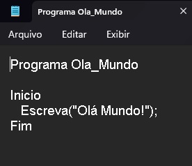

# Ola_Mundo_Em_LPP_PortuguesEstruturado_Portugol_Potigol_Metalinguagem_Pseudocodigo

**Olá Mundo em LPP | Português Estruturado | Portugol | Potigol | Metalinguagem | Pseudocódigo - Escola do Autodidata**

## Enunciado

**Crie um programa que escreva na saída do usuário a mensagem "Olá Mundo!".**

Autor: Erick Leite Freire 
Criado em: 17-09-2023 
Site: [Escola do Autodidata](https://www.escoladoautodidata.com.br) 
